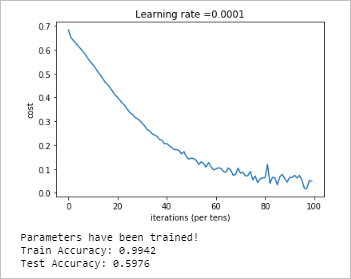
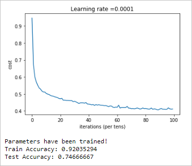

# Cat Vs. Dog classification

This project contains two variations over the dog vs. cat problem. First, we did the classification using just a sigmid output layer were our model performed not so good with the train as well as test. We got the training accuracy of 57.34% and test accuracy of 56.77%. But later on we train the images of dog and cat using 2 hidden layer and 1 output layer and our accuracy stats got improved.

We have trained a cat vs. dog classifier model using 2 hidden layer and 1 output layer. The output layer has two neuron units which gives one-hot vector output. If the output is $\begin{bmatrix}1\\ 0\end{bmatrix}$ meansthe corresponding image is labeled as cat and if it is $\begin{bmatrix}0\\ 1\end{bmatrix}$ means it is dog.

We first took 10,000 images of cat and 10,000 images of dog and shuffled them. After shuffling, kept 17,000 images for training and 3,000 images for testing the model.

**Our model functions as follows:**

    

Where, $X.shape = (n_x, m), \\ W^{[1]}.shape = (25, n_x),  \\ b^{[1]}.shape = (25, 1),  \\ W^{[2]}.shape = (12, 25) \\ b^{[2]}.shape = (12, 1) \\ W^{[3]}.shape = (2, 12) \\ b^{[3]}.shape = (2, 1). $

here $n_x$ is 17,000.

Also, the activation function used here $g^{[1]}$ and $g^{[2]}$ are relu. And the last function $g^{[3]}$ is the softmax.

$A^{[3]}$ is our final output which can also be said as $\hat{y}$. Hence our error is $L(y - \hat{y})$. Also, our loss function is $$Loss = -(ylog\hat{y} -(1-y)log(1 - \hat{y}))$$.

This is the function which we have to minimize.

Took 17000 images for training examples and 3000 images for dev-test. All the images are labelled as weither cat or dog because it is supervised learning.

<b><i>Hidden layers with units </i></b>

During training we have used Adam Optimizer to speed up our gradient training and also initialized the weights with Xavier Initializer method in the beginning of our training.

When we completed with our training we get the weights which gave 99.42% training accuracy. But out model performed badly on test data with an accuracy of just 59.76%. The model is overfitted with the training data. The model graphs are shown below:

***Before regularization***

    
So, to reduce high variance from the model few of the techniques are: increase the number of training images data which can be done either by adding some of the new clicked pics of dog-cat to the dataset or we can do data-augmentation on the available image data(i.e. generate image either by  croppping, flipping or rotating the image). We can also reduce the variance by regularization (either $L_1$ or $L_2$), dropout or by early stopping of model training.

So, we introduce $L_2$ regularization to the loss function and introduce dropout at the activation neurons with the keep_prob of 0.7. 
    
***After regularization***

Thereon, we get the total test accuracy of 74.67% which is an improvement over the previous test accuracy. That means we get an increment of 14.91% over test accuray after introducing regularization to the model architecture.

Even though the train accuracy is reduced from 99.42% to 92.03% because the regulaization increases the bias in the system and thus generalizing the model. But finally, we are concerned with the test accuracy, which got improved.

