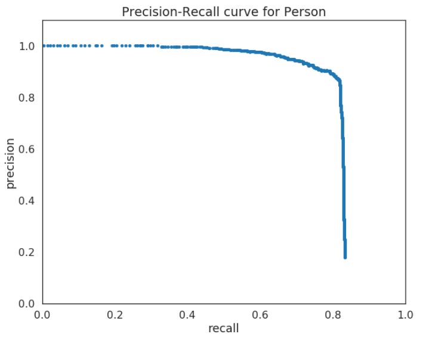
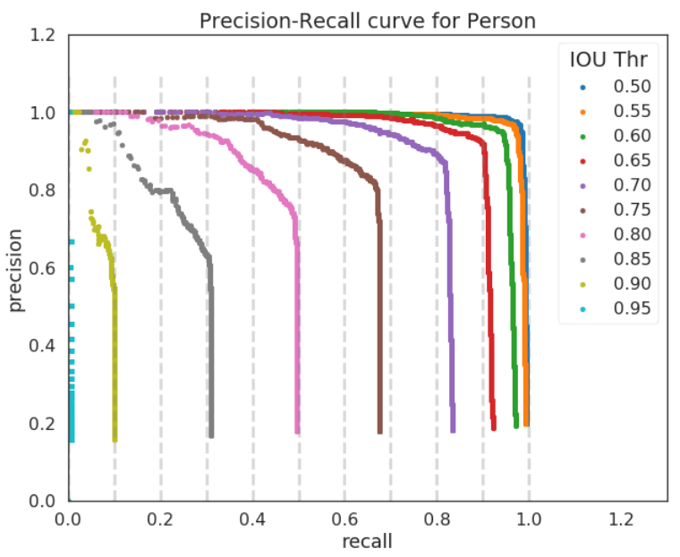

# YOLO Image Detection

### Description

This project is an implementation of the YOLO DNN model on [yolo website](https://pjreddie.com/darknet/yolo/). In the beginning we must do some image processing. The images is first preprocessed to the image of size (608,608,3). Here, we have used the well- developed DNN YOLO architecture for the image detection. The architecture used 24 convolutional layer followed by 2 fully connected layers, batch-normalization, the activation function used here is leaky-relu. The architecture uses max pooling and also the padding of the bits to the image matrix whenever required. The architecture is trained for 80 different object classes. The official YOLOv2 model and the pre-trained weights on coco dataset are used in this projects provided on the official YOLO website.

Now we have the trained weights and the model architecture from the YOLO website. Its time to predict the image. First, we input a batch of images of shape (m, 608, 608, 3) and get the output matrix of size (m, 19, 19, 3). The output is a list of bounding boxes along with the recognized classes. Each bounding box is represented by 6 numbers $(p_c,b_x,b_y,b_h,b_w,c)$ as explained above. If you expand c into an 80-dimensional vector, each bounding box is then represented by 85 numbers. We have used 5 anchors over here.
$$IMAGE (m, 608, 608, 3) -> DEEP CNN -> ENCODING (m, 19, 19, 5, 85)$$

Each cell gives you 5 boxes for each anchor used. In total, the model predicts: 19x19x5 = 1805 boxes. To get the desired boxes we'll have carry out these steps
- Get rid of boxes with a low score (meaning, the box is not very confident about detecting a class)
- Select only one box when several boxes overlap with each other and detect the same object.

$STEP 1:$ To get rid of the boxes with low score first we'll have to find the score of the 19X19 boxes from the output matrix.
Now, for each box (of each cell) we will compute the following elementwise product and extract a probability that the box contains a certain class.

And, then filter out all the boxes with the probability less than the given threshold (say 0.6). yolo_filter_boxes function does the same.

$STEP 2$: Even after filtering by thresholding over the classes scores, you still end up a lot of overlapping boxes. The second filter selects the right boxes and is called non-maximum suppression (NMS).

Non-max suppression uses the very important function called **"Intersection over Union"**, or IoU.

In the non-max suppression, every remaining box after step 1 is checked on with the box of the same object class as detected on the basis of the IoU threshold (say 0.5). If in case the two boxes of the same object class were found to have the the IoU greater than the IoU threshold. Then, the two boxes were considered associated with the same object in the image and the one with low probability score have to be removed.

### Accuracy measurement : 

Accuracy measurement is very significant for any model. But here, we have to consider 2 things: <b>classification</b> and <b>localization</b>. So, <b>mAP( Mean Average Precision)</b> is used to measure the accuracy for the object detected.
For AP(Average precision), first precision-recall curve is computed for the models detection output, by varying the model score threshold.

<caption>
[Figure 1](https://medium.com/@timothycarlen/understanding-the-map-evaluation-metric-for-object-detection-a07fe6962cf3)
</caption>
Every class will have a single curve.

<i><b>Recall </b></i> is defined as the proportion of all positive examples ranked above a given probability_score (probability for an object to be present in the image).

<i><b>Precision </b></i>is the proportion of all examples above the rank which are from the positive class.

$$AP = \frac{1}{11}\sum_{r\in(0, 0.1, ..., 1)}P_{interp}(r)$$

$P_{interp}(r)$ is the interpolation r by taking the maximum precision measured for a method for which the corresponding recalll exceeds r. Interpolation reduces the wiggles in precision/recall curve.

This was for the classification task. For correlation we have to use IoU(Intersection over Union) threshold as for each particular class of object we plot the precision/recall curve with respect to every IoU threshold and take the mean of all.

<caption>
[Figure 2](https://medium.com/@timothycarlen/understanding-the-map-evaluation-metric-for-object-detection-a07fe6962cf3)
</caption>

**References**: The ideas presented in this notebook came primarily from the YOLO papers. The implementation here also took significant inspiration and used many components from Allan Zelener's github repository. The pretrained weights used in this exercise came from the official YOLO website. Also some of the idea in this notebook is from the angdrew_ng course on deep learning, coursera.
